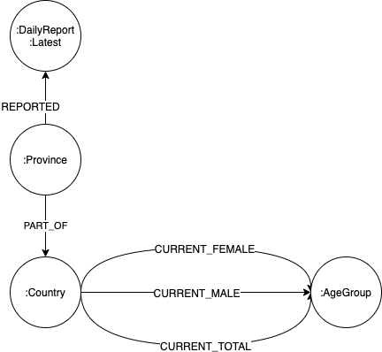

# CovidGraph data loading module for case statistics from JHU and UN World Population data 

Build Docker image:

```shell script
docker build -t data_jhu_population .
```

You need to set the following environment variables in the Docker container to run it:

```shell script
GC_NEO4J_URL: URL of Neo4j instance
GC_NEO4J_USER: Neo4j username
GC_NEO4J_PASSWORD: Neo4j password
RUN_MODE: test or full
```
### RUN_MODE
The `test` mode runs some basic tests including availability of files. it is meant to be executed at runtime
in a data loading pipeline. The goal is to hae some basic sanity checks and avoid long running downloads if something is wrong.
This is only a part of the full test suit that is executed as part of CI.

Run the container:

```shell script
docker run --env GC_NEO4J_URL=bolt://myhost:7687 --env GC_NEO4J_USER=neo4j --env GC_NEO4J_PASSWORD=password --env RUN_MODE=test data_jhu_population
```

## Datamodel 


## Queries

Confirmed/death/recovered per country

```cypher
MATCH (c:Country)<-[:PART_OF]-(p:Province)-[:REPORTED]->(u:DailyReport:Latest)
WHERE c.name = 'China'
RETURN c.name, sum(u.confirmed)
```

Confirmed cases for one country (percentage of the total population)

```cypher
MATCH (c:Country)-[r:CURRENT_TOTAL]->(:AgeGroup)
WHERE c.name = 'China'
WITH c, sum(r.count) AS total_population
MATCH (c)<-[:PART_OF]-(:Province)-[:REPORTED]->(u:DailyReport:Latest)
WITH c.name AS Country, sum(u.confirmed) as Confirmed, max(u.date) AS Update, total_population AS Population
RETURN Country, Population, Confirmed, (toFloat(Confirmed)/Population)*100 AS percent
```


Confirmed cases per country (percentage of the total population)

```cypher
MATCH (c:Country)-[r:CURRENT_TOTAL]->(:AgeGroup)
WITH c, sum(r.count) AS total_population
MATCH (c)<-[:PART_OF]-(:Province)-[:REPORTED]->(u:DailyReport:Latest)
WITH c.name AS Country, sum(u.confirmed) as Confirmed, max(u.date) AS Update, total_population AS Population
RETURN Country, Population, Confirmed, (toFloat(Confirmed)/Population)*100 AS percent ORDER BY percent DESC
```

Confirmed cases (total and percentage) for all entries for a country (one row for each province, many rows for China) -> query works only for countries that have **only one province**

```cypher
MATCH (c:Country)-[r:CURRENT_TOTAL]->(:AgeGroup)
WHERE c.name = 'Germany'
WITH c, sum(r.count) AS population
MATCH (c)<-[:PART_OF]-(p:Province)-[:REPORTED]->(u:DailyReport)
RETURN DISTINCT c.name, p.name, u.date, population, u.confirmed, (toFloat(u.confirmed)/population)*100 AS percent ORDER BY u.date DESC LIMIT 10
```

Timeline of confirmed cases by country (aggregated over all provinces)

```cypher
MATCH (c:Country)<-[:PART_OF]-(:Province)-[:REPORTED]->(u:DailyReport)
WHERE c.name = 'China'
WITH DISTINCT [u.date.year, u.date.month, u.date.day] AS date, sum(u.confirmed) AS sum
RETURN date, sum ORDER BY date
```

- problem: not every province for China is reported every day, thus the sum of all confirmed cases on data e.g. 18.03. does not equal the total nunber of confirmed cases at that date (because province X did report last on 17.03.) 

Number of people older than 70 in a country

```cypher
match (c:Country)-[r:CURRENT_TOTAL]-(ag:AgeGroup)
WHERE c.name = 'Germany' AND ag.start >= 70
RETURN sum(r.count)
```

## Datasources

### Covid-19 cases from John Hopkins University

John Hopkins University (JHU) aggregates data from WHO and other health organizations in a daily report. It contains the number of confirmed cases, deaths and recovered patients.

Dashboard: https://coronavirus.jhu.edu/map.html
Data: https://github.com/CSSEGISandData/COVID-19

### Population data from the UN

The UN gathers data on world population statistics and publishes the world population prospects: https://population.un.org/wpp/

The latest data set in CSV format can be found here: https://population.un.org/wpp/Download/Standard/CSV/
